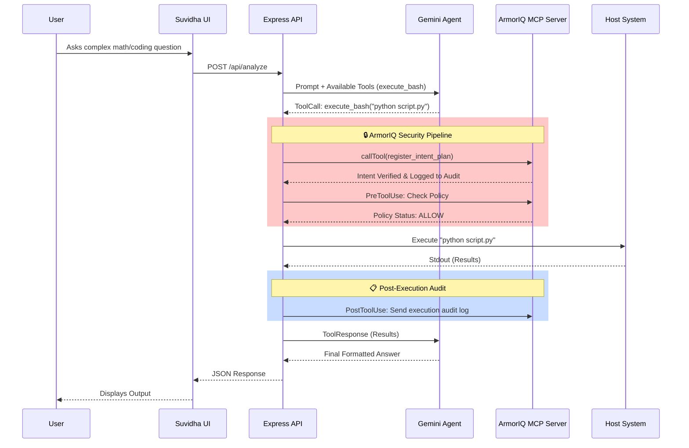

# 🚀 Suvidha AI Career Portal & Secure Agent Ecosystem
**Kaggle AI Agent Submission 2026**

**Suvidha** is a comprehensive, highly secure, AI-powered educational and career guidance platform. More than just a career portal, it features a sophisticated backend powered by a **Google Gemini AI Agent** capable of autonomous actions, safeguarded by **ArmorIQ's intent-based security enforcement (armorCodex)**.

---

## 📑 Category 1: The Pitch - Problem, Solution, Value

### 🚨 The Problem
Traditional educational portals lack intelligent interactivity, and providing AI Agents with the ability to execute code or run backend tools introduces massive security risks. A single hallucination by an AI agent with server access could compromise the entire system. Students in regional areas (like Jammu & Kashmir) need deep, accurate, and context-aware assistance, but delivering this via autonomous agents securely is a major challenge.

### 💡 The Solution & Value
**Suvidha** bridges the educational gap with a highly interactive UI while solving the agent security problem via a robust backend.
1. **Regional College Directory**: Curated database with a comparison engine for regional institutions.
2. **Dynamic AI Question Solver**: An intelligent agent that can process images/text and securely execute calculations or scripts on the backend.
3. **Role-Based Portals**: Dedicated authentication for Students, NGOs, and Government officials for targeted resource allocation.
4. **Zero-Trust AI Execution**: Integration with ArmorIQ (armorCodex) ensures that every action the AI agent attempts is cryptographically verified against a pre-registered intent plan before execution.

**Why Agents?** 
Agents elevate the platform from a simple chatbot to an autonomous problem solver. Instead of relying on static pre-programmed APIs, our Gemini-powered Agent can dynamically write and execute bash tools to calculate mathematical problems, scrape data, or compile code for students in real-time.

---

## 🏗️ Category 2: The Implementation - Architecture & Code

Our architecture heavily demonstrates the **Key Concepts** required by the Kaggle Evaluation: **Agents**, **MCP Servers**, and **Security Features**.

### 1. Multi-Agent Ecosystem (Code)
The core of our AI engine lives in `HACATHON-MATHURA/server.js`. We utilize the `@google/genai` SDK with function calling enabled. When a student queries the solver, the Gemini model can autonomously decide to use the `execute_bash` tool to resolve it.

### 2. MCP Server Integration (Code)
To decouple our security logic from the core agent, we utilize a **Model Context Protocol (MCP)** architecture. 
Our Node.js Express backend acts as an **MCP Client** (`mcpClient.js`). It connects via `stdio` transport to an independent, locally running MCP server (`armorCodex/hosted-mcp/server.mjs`).

### 3. Advanced Security Features (Code)
Security is the cornerstone of this project. We have implemented a multi-layered security approach:
- **API Key Abstraction**: The AI Agent Widget (`ai-agent-widget.js`) never communicates with Gemini directly. All requests are proxied through our custom Express server.
- **Role-Based Access Control (RBAC)**: Distinct authorization boundaries using Firebase for Students, NGOs, and Government entities.
- **ArmorIQ Intent-Based Enforcement**: Running AI-generated bash commands is inherently dangerous. We implemented **armorCodex**. Before the Express backend executes the agent's requested tool, it communicates with the `armorCodex` MCP Server to verify the command against local security policies. It also sends signed intent and audit events to ArmorIQ IAP.

---

## 🛡️ ArmorIQ Security Execution Flow

To ensure the AI Agent cannot run malicious commands, we utilize an intent-based verification pipeline. Below is the architecture diagram demonstrating how **Armor IQ (armorCodex)** secures our agent.



---

## 🚀 Setup & Deployability

We have streamlined deployability using `concurrently` to launch the entire multi-service ecosystem locally with a single command. 

### Prerequisites
- Node.js (v18+)
- Local `armorCodex` MCP server configured
- API Key (Set up environment variable `VITE_GEMINI_API_KEY`)

### How to Run Locally

1. **Clone the Repo:**
   ```bash
   git clone https://github.com/crazy-develop/code-kaggle.git
   cd code-kaggle
   ```

2. **Install Dependencies:**
   ```bash
   cd HACATHON-MATHURA
   npm install
   ```

3. **Launch the Secure Agent Ecosystem:**
   ```bash
   npm run dev
   ```
   *This single command leverages `concurrently` to simultaneously launch the Vite React UI on port 3000 and the secure Express Agent Backend on port 3001.*

4. **Launch Main Portal:**
   Open the root `index.html` via Live Server or any static web server to access the primary Suvidha HTML/CSS dashboard.

---
*Built with ❤️ for Sanskriti HackIndia and Kaggle AI Agent Track 2026*